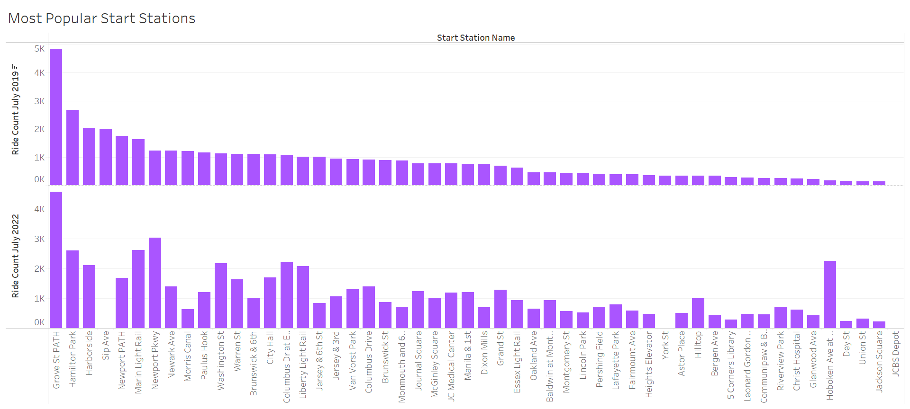
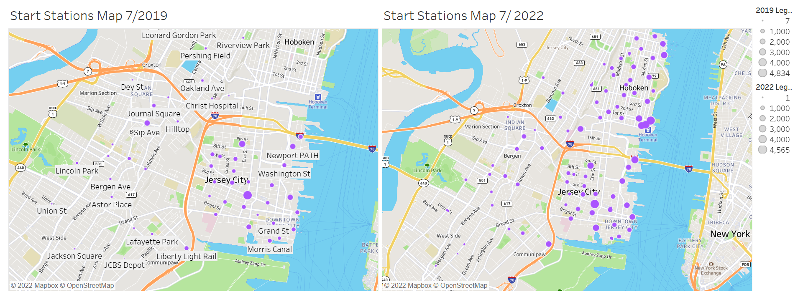
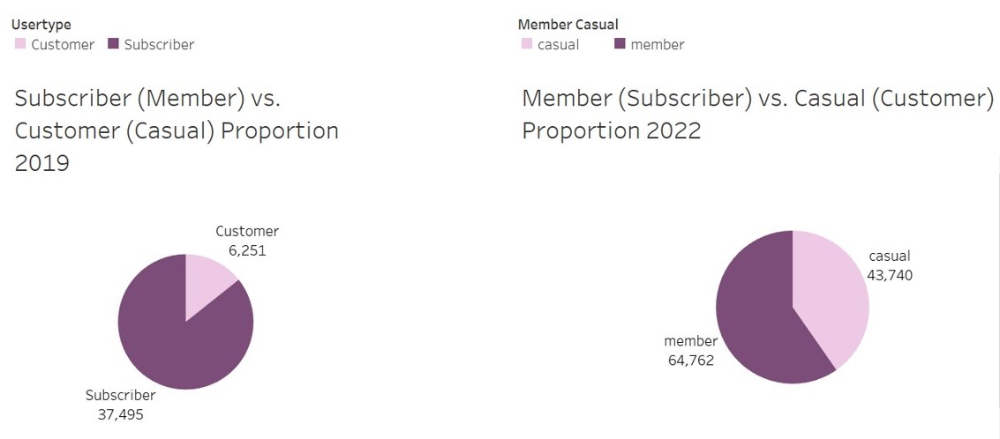
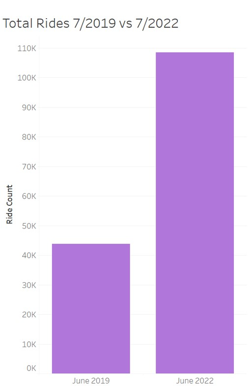
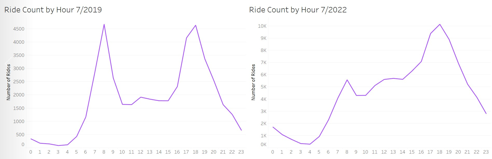
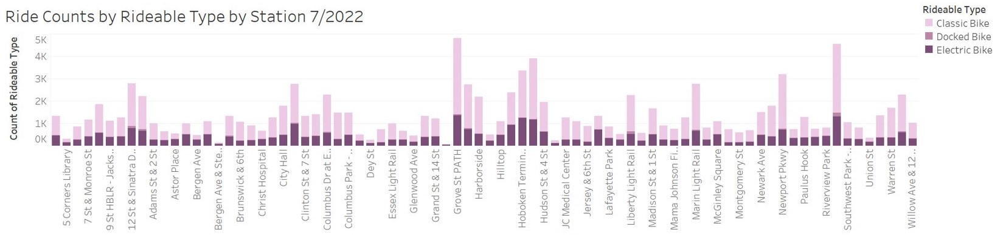
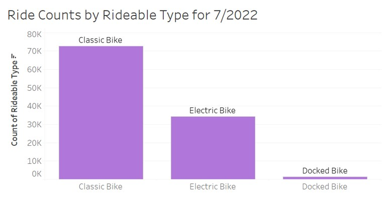

# tableau-challenge
NU Data Science Bootcamp Tableau Homework 

The visualizations created can be previewed by opening the Tableau-Challenge file or by visiting https://public.tableau.com/app/profile/sydney.m.cohen/viz/Tableau-Challenge_16626783442270/Story

## Analysis 

### Most Popular Start Stations

The top bar chart illustrates the amount of rides that started at each station in July 2019, with the bottom bar chart illustrating the same phenomena but in 2022. I chose these dates to see if COVID-19 had any impact on the data. Grove St Path remained the most popular start station over the three year period, whereas other stations ceased to exist (Sip Ave, York St, JCBS Depot). Some stations experienced a large boost in popularity, most evident visually being the Bobboken Ave at Monmouth St and Newport Pkwy. Across the board, there are more rides for most of the stations in 2022 compared to 2019, likely due to the increase in total ridership over this period. 

### Start Station Map 

The map on the left illustrates the start bike stations from 7/2019 with the size of the bubbles indicating their popularity. The same is true for the map on the right, but for 7/2022. Immediately evident without any real analysis is the fact that there are many more start stations around the same area in 2022, indicating massive growth of the popularity of these bikes. Additionally, there are more larger bubbles on the right (2022) map indicating that not only are there more bike start stations, but they are also more popular. It seems that Grove St. Path remained popular, likely due to being at a large intersection near a public transit station by downtown Jersey, and out of the new bike stations that appeared by 7/2022, those clustered around Hoboken Terminal seem to enjoy the most popularity. Perhaps these trends could indicate that bike stations strategically based around major public transit hubs may be more popular.  

### Subscriber vs. Customer 2019 vs 2022 

The pie chart on the left indicates the proportion of subscribers to customers in June 2019, with the pie chart on the left depicting the same phenomenon but in June 2022. There was a name change in the way the company categorized yearly subscribers versus single-time customers, so for clarity be aware that "subscriber" and "member" both refer to yearly subscribers, and "casual" and "customer" both refer to single-time customers. While the 2019 data is overwhelmingly dominated by subscribers, the 2022 data has a smaller proportion, and more casual users. These proportions must be contextualized with the growth of the business as a whole, even though the subscriber proportion went down over the years, the actual number of subscribers almost doubled. The bar chart just below illustrates how large the rider-ship has grown for this company, and gives context to the shifting proportions seen on the pie charts. 

### Rides by the Hour 

The graphs above illustrate the number of rides that occured per hour on a 24-hour day, pulling data for the whole month of June 2019 on the left, and June 2022 on the right. Since both datasets occured during the same summer month in New Jersey, the hourly weather should be roughly comperable. Also important to note is the differences of the scaling on the Y-axes. Since there were far fewer riders in 2019, their decisions made much larger impacts on the line. Meanwhile, since there are so many riders in 2022, individual deviations may have less of an impact. Across both graphs there seems to be a steady increase in ridership starting around 5am, with a spike in the morning around 8am, and another spike around 7pm. A major difference evident by these graphs is that the "lull" time between the morning and evening peaks is consistently low in 2019, whereas in 2022 there is a slight plateau and then a stready increase in the amount of rides util the next peak. Both seem to experience a sharp dropoff in ridership in the very late evening/early morning hours. 

### Ride Types 

These visualizations were made using only the 2022 dataset, as the 2019 dataset either didn't have this feature of different ride types implemented or data simply wasn't collected on it. The stacked bar chart above illustrates the breakdown of ride type (classic, electric, or docked) per station, data which could be used to more efficiently stock these locations. Though the classic bike dominates most of the bars, there are some stations with a significant proportion of electric bike usage that perhaps may need more bikes stocked. The electric bikes appear to take up a larger share of the proportion for smaller, less popular stations, perhaps indicating that when more electric bikes are available people will use them, or perhaps that the electric bikes are better suited for that area. This is an area worthy of further investigation. What we can see from the simple bar chart below is that overall classic bikes are by far the most popular, with electric bikes experiences a considerable amount of use but still signiicantly less than the classic bikes. Docked bikes are the lowest type used, by a large amount. 

